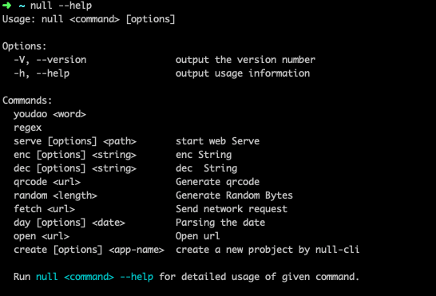

<p align="center"><a href="#" target="_blank" rel="noopener noreferrer"></a></p>

<p align="center">A <b>command</b> makes you more efficient</p>

## Getting Started

### Installation

```shell
npm install null-cli -g

yarn add null-cli -g
```

### API



### Documentation

📚[Docs Guide](./docs/en/Installation.md)

# License

null-cli licensed under a [Mit License](./LICENSE).
